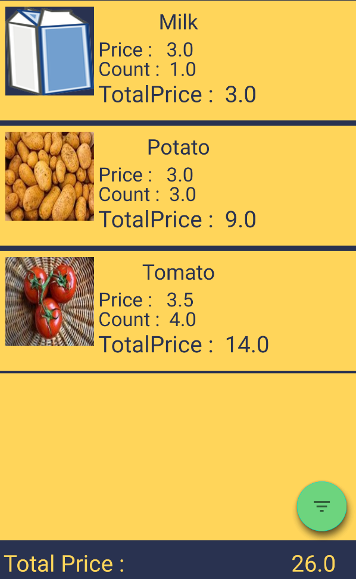
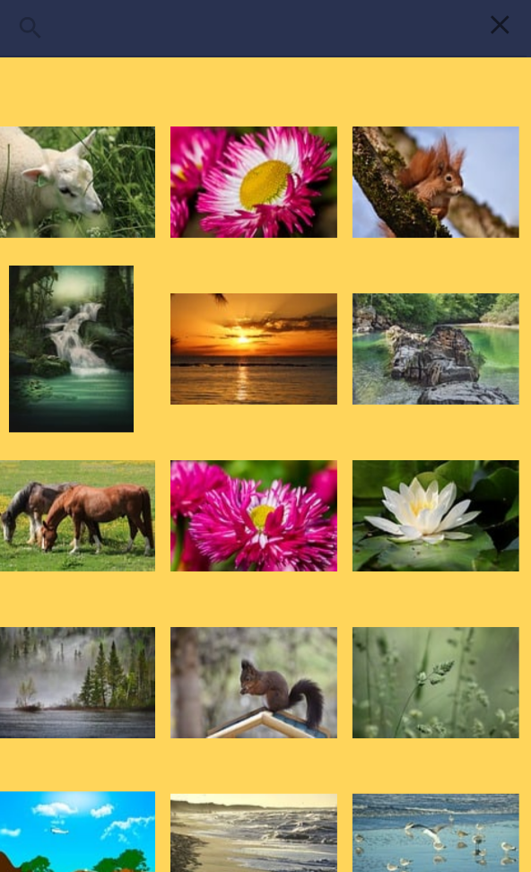
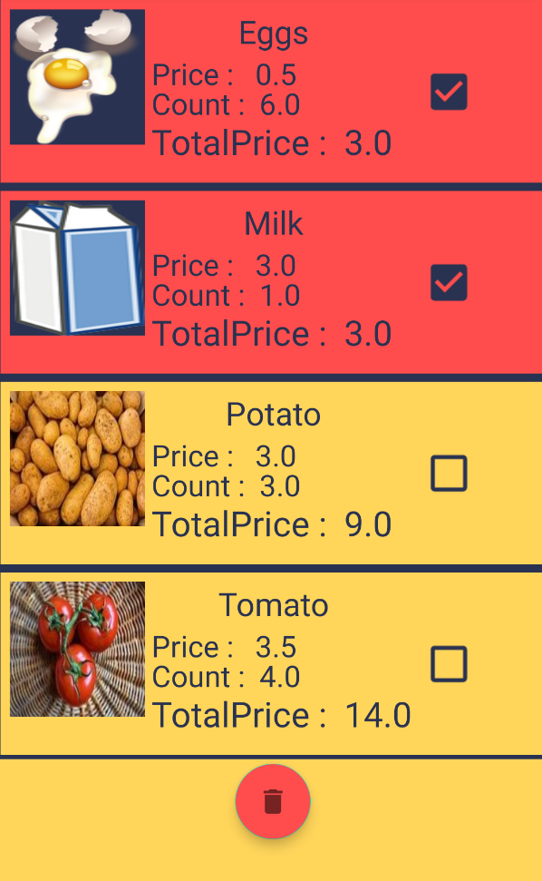

<h1 align="center"> 📃 ShoppingList 📃 </h1>

 
 

 

</h1>

  

## Project Overview 🎉
An app to help you create a simple shopping list.While working on this project, I learned firebase and glide and consolidated my knowledge of MVVM and Retrofit2
## Tech/framework used 🔧

| Tech                                                    | Description                              |
| ------------------------------------------------------- | ---------------------------------------- |
| [Retrofit2](https://square.github.io/retrofit/)                           | Retrofit turns  REST API into a Kotlin interface   |
| [Glide](https://github.com/bumptech/glide)                           |  Is an Image Loader Library   |
| [Firebase](https://firebase.google.com)                           | Firebase provides tools for tracking analytics, reporting and fixing app crashes, creating marketing and product experiment   |

## Screenshots 📺

  
   

<h2> A word from the author 💬 </h2>
 
 I finished working on the application when I achieved all the goals I set myself before starting the project.
 Therefore, the application is not complete and brought to the very end.
## API 🔱
https://pixabay.com/api/docs/
